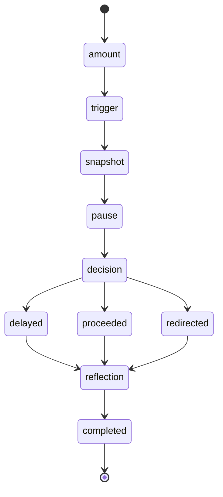
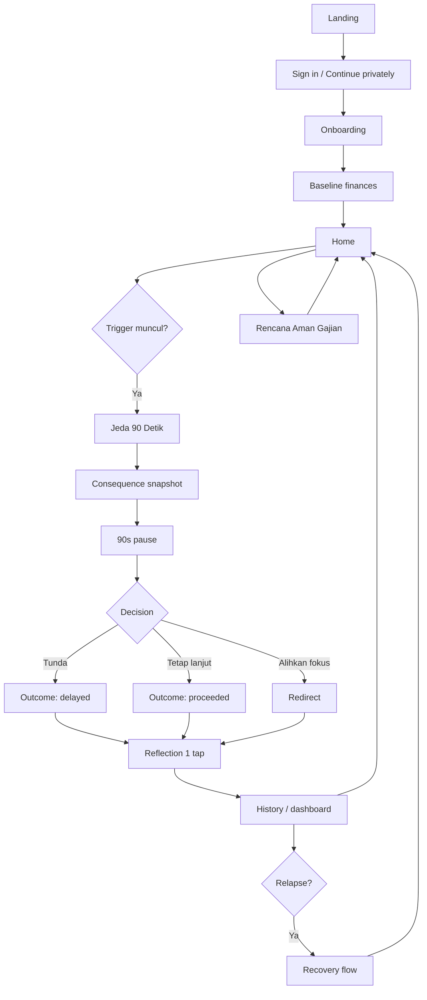

# DompetJujur — Product Requirements Document (PRD)

**Version:** 1.0  
**Product stage:** 24-hour hackathon MVP  
**Platform:** Mobile-first web app / PWA  
**Primary market:** Pekerja muda Indonesia  
**Recommended stack:** Next.js + TypeScript + Tailwind CSS + shadcn/ui + Supabase (Postgres, Auth, RLS)  
**Core product thesis:** Intervensi kecil pada momen rawan lebih berguna daripada nasihat panjang setelah keputusan impulsif terjadi.

---

## 1. Product Overview

### 1.1 Problem Statement
Pekerja muda dapat mengalami pola berulang:

**stres kerja → dorongan mencari pelarian → keputusan finansial impulsif/berisiko → penyesalan/kerugian → stres meningkat → mengulang perilaku**

Momen paling rawan sering terjadi:
- beberapa jam setelah gajian;
- malam hari setelah kerja;
- setelah kerugian dan muncul dorongan untuk "balik modal";
- ketika limit paylater/utang masih tersedia;
- saat pengguna sedang relapse setelah sebelumnya berhasil berhenti.

Masalah utama bukan kurangnya informasi. Pada saat impuls muncul, pengguna justru membutuhkan **friction singkat, konkret, privat, dan tidak menghakimi** sebelum mengambil keputusan.

### 1.2 Target Persona
**Nama persona:** Raka, 24 tahun  
**Pekerjaan:** staf operasional / admin / junior professional  
**Pendapatan:** Rp4.500.000–Rp8.000.000/bulan  
**Kebiasaan digital:** mobile-first, e-wallet, mobile banking, paylater, media sosial  
**Pain points:**
- merasa "cuma sekali" ketika impuls muncul;
- sulit melihat dampak keputusan kecil terhadap kebutuhan bulan berjalan;
- malu bercerita;
- tidak ingin aplikasi terasa seperti klinik atau ceramah;
- sering mengambil keputusan pada malam hari saat lelah.

### 1.3 Jobs To Be Done
Saat saya merasa ingin mengeluarkan uang untuk perilaku finansial berisiko, saya ingin sebuah sistem yang membantu saya berhenti sebentar, melihat konsekuensinya secara nyata, dan memilih langkah yang lebih aman tanpa menghakimi saya.

### 1.4 Value Proposition
**DompetJujur membantu pengguna menciptakan jeda pada momen impulsif, memvisualisasikan dampak uang secara nyata, dan mencatat keputusan kecil yang mengurangi risiko kerugian berikutnya.**

### 1.5 Positioning
> **DompetJujur adalah “friction layer” pribadi sebelum keputusan finansial impulsif terjadi.**

### 1.6 Non-Goals
DompetJujur **bukan**:
- aplikasi prediksi taruhan;
- alat menghitung peluang menang;
- platform transaksi judi;
- aplikasi pinjaman/paylater;
- aplikasi diagnosis kesehatan mental;
- pengganti psikolog, konselor, dokter, atau penasihat keuangan;
- sistem pemblokiran OS-level untuk aplikasi/situs pada MVP;
- aplikasi investasi.

---

## 2. Product Principles

1. **Privacy-first**  
   Simpan data seminimal mungkin. Tidak perlu rekening bank, histori transaksi aktual, nomor kartu, atau data perjudian spesifik.

2. **Non-judgmental**  
   Copy tidak menggunakan istilah “gagal”, “lemah”, atau “bodoh”. Fokus pada keputusan berikutnya.

3. **Friction at the right moment**  
   Produk harus cepat dibuka ketika dorongan muncul. Intervensi utama dimulai dalam ≤ 2 tap.

4. **Measurable harm reduction**  
   Keberhasilan tidak diukur dari “menjadi sempurna”, tetapi dari jumlah jeda berhasil, dana yang tidak jadi dikeluarkan, dan recovery setelah relapse.

5. **Mobile-first**  
   Semua fungsi inti nyaman digunakan dengan satu tangan pada layar 360–430 px.

---

## 3. MVP Scope — 24 Hours

### 3.1 P0 — Must Have
| Feature | Status | Rationale |
|---|---|---|
| Onboarding + Baseline | P0 | Menentukan konteks uang tanpa koneksi rekening |
| **Jeda 90 Detik — Killer Feature** | P0 | Intervensi utama dan demo paling kuat |
| Rencana Aman Gajian | P0 | Memberi konteks “uang aman vs uang rawan” |
| Outcome + Riwayat | P0 | Membuktikan dampak dan menciptakan loop refleksi |

### 3.2 P1 — Should Have
| Feature | Status | Rationale |
|---|---|---|
| Quick Trigger “Saya Lagi Kepikiran” | P1 | Shortcut ke Jeda 90 Detik |
| Relapse / Recovery Flow | P1 | Menghindari pola malu → berhenti pakai aplikasi |
| Dashboard Ringkas | P1 | Menampilkan harm-reduction metric |

### 3.3 P2 — Nice to Have
| Feature | Status | Rationale |
|---|---|---|
| Trusted Contact | P2 | Dukungan sosial opsional |
| Reminder berbasis jam rawan | P2 | Membantu pola berulang |
| AI Reflection Summary | P2 | Hanya untuk personalisasi copy, bukan keputusan inti |
| PWA install prompt | P2 | Meningkatkan retention |

### 3.4 Cut-line
Jika waktu mepet:
1. Pertahankan: Onboarding → Jeda 90 Detik → Outcome → History.
2. Sederhanakan Rencana Aman Gajian menjadi 3 input.
3. Potong Trusted Contact, reminder, LLM, dan PWA install.
4. Jangan mengorbankan safety copy, RLS, atau delete-account flow.

---

## 4. Core Feature Requirements

# 4.1 Onboarding + Baseline

### User Story
Sebagai pengguna baru, saya ingin memasukkan kondisi finansial dasar tanpa menghubungkan rekening bank agar aplikasi dapat memberi konteks yang relevan.

### Inputs
- Nama panggilan (opsional)
- Pendapatan bersih bulanan
- Total kebutuhan wajib bulanan
- Total cicilan/paylater bulanan
- Tanggal gajian
- Jam rawan utama:
  - setelah kerja;
  - malam hari;
  - setelah gajian;
  - setelah kerugian;
  - lainnya.

### Derived Values
```text
uang_fleksibel = pendapatan - kebutuhan_wajib - cicilan
batas_aman_harian = max(uang_fleksibel / 30, 0)
```

Nilai ini **bukan saran keuangan profesional**, hanya konteks visual.

### Acceptance Criteria
- User bisa menyelesaikan onboarding ≤ 90 detik.
- Tidak ada field wajib yang meminta data rekening.
- Pendapatan, kebutuhan wajib, cicilan harus menerima angka Rupiah ≥ 0.
- Jika kebutuhan + cicilan > pendapatan, UI tidak memblokir; tampilkan pesan netral.
- Data disimpan hanya setelah pengguna menekan “Simpan & lanjut”.

### Edge Cases
- Pendapatan tidak tetap → checkbox “Pendapatan saya berubah-ubah”.
- Pengguna tidak tahu angka pasti → boleh masukkan estimasi.
- Nilai fleksibel negatif → tampilkan “ruang uang bulan ini sedang ketat”; jangan menampilkan angka “aman dibelanjakan”.

### Empty / Loading / Error
- Empty: placeholder contoh nominal.
- Loading: button spinner ≤ 2 detik.
- Error: “Data belum tersimpan. Coba lagi—inputmu tetap ada di layar.”

### Stored State
`financial_profiles`

### Logic
100% deterministic.

---

# 4.2 Jeda 90 Detik — KILLER FEATURE

### Purpose
Mengubah keputusan impulsif menjadi keputusan sadar melalui 90 detik friction, consequence visualization, dan pilihan outcome.

### Entry Points
- Home CTA “Saya lagi kepikiran”
- Shortcut bottom navigation
- Dari halaman Rencana Gajian
- Optional notification/PWA shortcut

### User Story
Sebagai pengguna yang sedang terdorong mengeluarkan uang secara impulsif, saya ingin jeda yang cepat dan tidak menghakimi supaya saya bisa menilai ulang keputusan sebelum bertindak.

### Step-by-Step Flow

#### Step 1 — Nominal
Prompt:
> “Berapa uang yang lagi kepikiran untuk kamu keluarkan?”

Input: nominal Rupiah.

#### Step 2 — Trigger
Pilih 1:
- Lagi stres
- Baru gajian
- Mau balikin kerugian
- Bosan / pengin pelarian
- Lagi pegang limit paylater
- Lainnya

#### Step 3 — Consequence Snapshot
Sistem menampilkan:
- nominal impuls;
- persentase dari uang fleksibel bulan ini;
- ekuivalen terhadap kebutuhan yang pengguna pilih sebelumnya (mis. makan, transport, cicilan);
- opsi neutral copy.

Contoh:
> “Rp350.000 = 22% dari ruang uang fleksibelmu bulan ini.”

#### Step 4 — 90-Second Pause
Timer 90 detik dengan animasi napas sederhana.
Tiga prompt bergantian:
1. “Tidak perlu memutuskan sekarang.”
2. “Dorongan bisa naik, lalu turun.”
3. “Kita cuma memberi jarak 90 detik.”

Tidak ada tombol skip pada 30 detik pertama. Setelah 30 detik muncul secondary action:
> “Saya tetap ingin lanjut setelah jeda.”

Tombol tidak langsung mengakhiri timer; hanya menandai intent.

#### Step 5 — Choice
Setelah timer:
- Primary: **“Saya tunda dulu”**
- Secondary: **“Saya tetap memilih lanjut”**
- Tertiary: “Saya pindahkan fokus”

Jika “pindahkan fokus”:
- minum air;
- keluar dari aplikasi 10 menit;
- chat orang tepercaya;
- buka aktivitas lain.

#### Step 6 — Outcome
Jika tunda:
> “Bagus. Kamu baru membuat jarak antara dorongan dan keputusan.”

Jika lanjut:
> “Terima kasih sudah jujur. Catatan ini bukan untuk menghakimi. Kita mulai lagi dari keputusan berikutnya.”

### Acceptance Criteria
- Flow dapat dimulai ≤ 2 tap dari home.
- Timer tetap berjalan saat screen lock singkat; gunakan timestamp, bukan interval saja.
- Refresh tidak mereset session.
- Nominal dan outcome tersimpan setelah session selesai.
- User dapat memilih “lanjut” tanpa shame copy.
- Tidak ada copy yang mengoptimalkan peluang taruhan.

### State Machine


### Stored State
- amount
- trigger_type
- started_at
- pause_completed_at
- intent_during_pause
- final_outcome
- perceived_urge_before (optional 1–5)
- perceived_urge_after (optional 1–5)

### Deterministic vs LLM
- Timer: deterministic
- Consequence math: deterministic
- Suggested action: deterministic rule set
- LLM: not required for MVP

---

# 4.3 Rencana Aman Gajian

### Purpose
Memberi pengguna gambaran sederhana tentang uang yang “sudah punya tugas” sebelum momen rawan setelah gajian.

### User Story
Sebagai pengguna, saya ingin memisahkan uang wajib dari uang fleksibel agar saya tidak melihat seluruh saldo sebagai uang bebas.

### Inputs
- Pendapatan bulan ini
- Kebutuhan wajib
- Cicilan/paylater
- Buffer aman opsional

### Output
- Uang sudah punya tugas
- Ruang fleksibel bulan ini
- Buffer aman
- Visual progress, bukan investment advice

### Core Formula
```text
committed = mandatory + debt + buffer
flexible = max(income - committed, 0)
```

### Acceptance Criteria
- Edit nominal kapan saja.
- Tidak memerlukan sinkronisasi bank.
- Jika flexible = 0, jangan tampilkan rekomendasi belanja.
- Setelah simpan, home menampilkan konteks nominal saat menjalankan Jeda 90 Detik.

### Edge Case
Jika pengguna memasukkan nilai melebihi pendapatan:
> “Total kebutuhanmu lebih besar dari pemasukan yang dicatat. DompetJujur tidak akan menebak solusinya—kamu tetap bisa memakai fitur Jeda.”

### Stored State
`monthly_plans`

### Logic
Deterministic.

---

# 4.4 Outcome + Riwayat

### Purpose
Membuat pengguna melihat kemajuan tanpa streak yang dapat memicu rasa gagal.

### Metrics
- Total sesi jeda
- Total sesi berhasil ditunda
- Nominal yang ditunda
- Median perubahan urge score
- Trigger paling sering

### Important
Jangan gunakan:
- streak harian;
- leaderboard;
- confetti casino-like;
- “level”;
- shame score.

### Acceptance Criteria
- History menampilkan maksimal 30 sesi terakhir.
- Pengguna dapat menghapus satu entry.
- Dashboard tidak menilai pengguna sebagai “baik/buruk”.
- Outcome “proceeded” tetap tampil netral.

### Stored State
`pause_sessions`

### Logic
Deterministic aggregation.

---

## 5. End-to-End UX Flow



---

## 6. Information Architecture

### Bottom Navigation
1. **Beranda**
2. **Jeda**
3. **Riwayat**
4. **Saya**

### Routes
```text
/
 /login
 /onboarding
 /home
 /pause/new
 /pause/[id]
 /pause/[id]/outcome
 /plan
 /history
 /profile
 /privacy
 /delete-account
```

MVP paling minimum:
```text
/onboarding
/home
/pause/new
/history
/profile
```

---

## 7. Data Model

### 7.1 Tables

#### `profiles`
| Field | Type | Notes |
|---|---|---|
| id | uuid PK | same as auth.users.id |
| nickname | text nullable | optional |
| payday_day | int nullable | 1–31 |
| primary_risk_window | text nullable | enum-like |
| created_at | timestamptz | |
| updated_at | timestamptz | |

#### `financial_profiles`
| Field | Type | Notes |
|---|---|---|
| id | uuid PK | |
| user_id | uuid FK | auth user |
| monthly_income | bigint | Rupiah integer |
| mandatory_expenses | bigint | |
| debt_payments | bigint | |
| income_variable | boolean | |
| created_at | timestamptz | |
| updated_at | timestamptz | |

#### `monthly_plans`
| Field | Type | Notes |
|---|---|---|
| id | uuid PK | |
| user_id | uuid FK | |
| month_key | date | first day of month |
| income | bigint | |
| mandatory | bigint | |
| debt | bigint | |
| safety_buffer | bigint | |
| flexible_amount | bigint | derived or cached |
| created_at | timestamptz | |

#### `pause_sessions`
| Field | Type | Notes |
|---|---|---|
| id | uuid PK | |
| user_id | uuid FK | |
| amount | bigint | |
| trigger_type | text | |
| urge_before | smallint nullable | 1–5 |
| urge_after | smallint nullable | 1–5 |
| intent_during_pause | text nullable | continue / unsure |
| outcome | text | delayed / proceeded / redirected |
| started_at | timestamptz | |
| pause_eligible_at | timestamptz | started + 90s |
| completed_at | timestamptz nullable | |
| created_at | timestamptz | |

#### `reflection_entries`
| Field | Type | Notes |
|---|---|---|
| id | uuid PK | |
| session_id | uuid FK | |
| user_id | uuid FK | |
| reflection_code | text | calmer / same / stronger / skipped |
| note | text nullable | max 240 chars |
| created_at | timestamptz | |

### 7.2 Enums
```text
trigger_type:
stress
payday
chasing_loss
boredom_escape
paylater_limit
other

outcome:
delayed
proceeded
redirected

risk_window:
after_work
late_night
after_payday
after_loss
other
```

### 7.3 Relationships
```text
auth.users 1—1 profiles
auth.users 1—N financial_profiles
auth.users 1—N monthly_plans
auth.users 1—N pause_sessions
pause_sessions 1—0..1 reflection_entries
```

### 7.4 Privacy
Do not store:
- gambling platform names unless user explicitly enters optional note;
- bank credentials;
- account numbers;
- transaction history;
- contact list;
- device fingerprint;
- precise location.

### 7.5 Retention
- User can delete individual pause sessions.
- User can delete account + all personal rows.
- Analytics should be aggregate and non-invasive.
- Avoid indefinite retention for raw free-text reflection; suggested auto-delete after 90 days in later versions.

---

## 8. Backend / API Requirements

### Auth
Recommended:
- Supabase Email OTP (6-digit One Time Password) for a persistent session.

### RLS
Every table must include:
```sql
user_id = auth.uid()
```

Policies:
- SELECT own rows only
- INSERT own rows only
- UPDATE own rows only
- DELETE own rows only

### Server Actions / Endpoints

#### `POST /api/onboarding`
Create/update profile and baseline.

#### `POST /api/pause`
Create pause session and return `pause_eligible_at`.

#### `PATCH /api/pause/:id`
Update intent/outcome/urge score.

#### `GET /api/dashboard`
Return aggregate:
```json
{
  "total_sessions": 8,
  "delayed_sessions": 5,
  "delayed_amount": 1350000,
  "top_trigger": "late_night"
}
```

#### `DELETE /api/pause/:id`
Delete one history record.

### Scheduled Jobs
None required for MVP.

### LLM
Not required.

Potential P2:
- summarize reflection into supportive sentence;
- never generate financial recommendations;
- deterministic fallback always available.

---

## 9. Analytics & Event Tracking

### Principle
Track product impact without tracking external browsing or gambling activity.

### Events
```text
onboarding_started
onboarding_completed
pause_started
pause_snapshot_viewed
pause_30s_reached
pause_90s_completed
pause_outcome_delayed
pause_outcome_proceeded
pause_outcome_redirected
reflection_completed
plan_created
plan_updated
history_viewed
session_deleted
account_deleted
```

### Funnel
```text
Home CTA
→ pause_started
→ pause_90s_completed
→ outcome selected
→ reflection completed
```

### Core Impact Metrics
1. `pause_completion_rate`
2. `delay_rate = delayed / completed sessions`
3. `delayed_amount_total`
4. `urge_delta = avg(urge_before - urge_after)`
5. `return_to_pause_within_7d`

Do not claim clinical efficacy.

---

## 10. Safety & Trust

### Anti-Shame Wording
Use:
- “Terima kasih sudah jujur.”
- “Keputusan berikutnya masih bisa berbeda.”
- “Kita buat jarak sebentar.”
- “Tidak perlu sempurna.”

Avoid:
- “Kamu gagal lagi.”
- “Jangan bodoh.”
- “Kamu kecanduan.”
- “Kamu pasti rugi.”
- “Kamu harus berhenti sekarang.”

### Crisis / Escalation Guardrail
If user enters free-text indicating immediate self-harm risk in future AI features:
- do not continue normal reflective coaching;
- show crisis-safe support guidance and encourage contacting local emergency/support services or a trusted person.

MVP can avoid analyzing free text altogether.

### Disclaimer
> DompetJujur adalah alat bantu refleksi dan harm-reduction. Ini bukan layanan medis, diagnosis kesehatan mental, penasihat keuangan, atau alat untuk mengoptimalkan taruhan.

### Privacy Notice
> Data yang kamu masukkan dipakai untuk menampilkan konteks di DompetJujur. Kami tidak membutuhkan akses rekening bank atau histori transaksi.

---

## 11. Killer Interaction — “Jeda 90 Detik”

### Why it wins a demo
- Instantly understandable.
- Visually demoable.
- Full-stack data can be shown.
- Clear measurable outcome.
- Product differentiation lives in interaction, not chatbot.

### Animation Sequence
**0–4s:** amount card slides upward.  
**4–8s:** consequence number animates from `Rp0` to target amount.  
**8–15s:** background becomes calmer; UI reduces to one timer.  
**15–45s:** breathing orb expands/contracts every 6 seconds.  
**30s:** secondary intent action fades in.  
**45–75s:** copy shifts to consequence reframing.  
**75–90s:** CTA area becomes visible.  
**90s:** timer turns into decision card.

### Before State
> “Dorongan: 5/5 · Rp350.000”

### After State
User chooses:
> “Saya tunda dulu”

System records:
```text
outcome = delayed
amount = 350000
urge_before = 5
urge_after = 3
```

### Measurable Outcome
Dashboard:
> “Bulan ini kamu membuat 5 jeda dan menunda Rp1.350.000.”

Wording intentionally says **menunda**, not “menyelamatkan”, because users may spend the money later.

---

## 12. 3-Minute Demo Script

### 0:00–0:25 — Problem
“Raka baru gajian. Jam 11 malam, habis kerja, stres, dan kepikiran mengeluarkan Rp350.000 untuk mengejar kerugian sebelumnya.”

Open Home.

### 0:25–0:50 — Trigger
Tap **Saya lagi kepikiran**.

Input:
- Rp350.000
- trigger: “Mau balikin kerugian”
- urge: 5/5

### 0:50–1:15 — Consequence
App shows:
> “Rp350.000 = 22% dari ruang uang fleksibelmu bulan ini.”

Then:
> “Tidak perlu memutuskan sekarang.”

### 1:15–1:55 — Pause
For live hackathon demo, use demo mode timer 10–15 seconds while production config remains 90 seconds.

Breathing animation runs.

### 1:55–2:20 — Decision
Tap:
> “Saya tunda dulu”

Urge after:
> 3/5

### 2:20–2:50 — Measurable outcome
Open history:
> 5 sesi ditunda  
> Rp1.350.000 total nominal yang ditunda

### 2:50–3:00 — Close
“DompetJujur tidak mencoba mengalahkan impuls dengan ceramah. Ia menciptakan friction tepat sebelum keputusan terjadi.”

---

## 13. 24-Hour Implementation Plan

### Hour 0–2
- Init Next.js + TS
- Tailwind/shadcn
- Supabase project
- Auth
- DB schema + RLS

### Hour 2–5
- Design tokens
- Onboarding
- Financial baseline
- Validation

### Hour 5–10
- Build Jeda 90 Detik flow
- Persistent timer via timestamp
- Consequence calculator
- Outcome write to DB

### Hour 10–13
- Rencana Aman Gajian
- Dashboard aggregation

### Hour 13–16
- History
- Delete item
- Profile/privacy

### Hour 16–19
- Polish transitions
- Accessibility
- Responsive testing
- Empty/loading/error states

### Hour 19–21
- Seed realistic demo data
- Build demo mode
- Test RLS/auth

### Hour 21–23
- Deploy Vercel
- End-to-end test
- Record fallback demo

### Hour 23–24
- Pitch deck / demo rehearsal
- Fix only P0 bugs

### Cut-line at Hour 14
If behind schedule:
- stop P1/P2;
- keep only onboarding, pause, outcome, history;
- no AI;
- no reminders;
- no trusted contact.

---

## 14. Definition of Done

### Product
- [ ] User can onboard.
- [ ] User can save financial baseline.
- [ ] User can start pause in ≤ 2 taps.
- [ ] Timer survives refresh.
- [ ] User can select neutral outcome.
- [ ] Outcome appears in history.
- [ ] Dashboard aggregate is correct.
- [ ] User can delete their session.
- [ ] Privacy/disclaimer visible.

### Engineering
- [ ] Supabase Auth works.
- [ ] RLS validated.
- [ ] No secrets in client bundle.
- [ ] Mobile viewport tested at 360/390/430 px.
- [ ] Lighthouse accessibility target ≥ 90 if feasible.
- [ ] Main flow has loading/error states.
- [ ] Production build passes.

### Hackathon
- [ ] Demo can finish in 3 minutes.
- [ ] Demo dataset is seeded.
- [ ] Killer interaction is visible immediately.
- [ ] Impact metric is shown.
- [ ] Clear distinction from generic chatbot.

---

## 15. Judging Narrative

### Problem Clarity
Financial impulsivity and harmful betting behavior often happen in short high-risk windows, not during long educational sessions.

### Feasibility
The MVP does not require banking integrations, browser blocking, prediction models, or an LLM.

### Wow Factor
The “Jeda 90 Detik” interaction converts invisible self-control into a visible, measurable moment.

### Differentiation
Most tools inform, block, or counsel. DompetJujur inserts a **personal friction layer** before the action.

### Full-Stack Depth
- Auth
- RLS
- financial context model
- stateful timer
- deterministic calculations
- event analytics
- history aggregation
- privacy controls

---

## 16. Future Expansion After Hackathon

Only after validating the MVP:
1. Scheduled “Mode Gajian” reminders.
2. Trusted-contact escalation.
3. Optional bank/open-finance integration with explicit consent.
4. App/site blocking integrations.
5. Evidence-based intervention experiments.
6. AI reflection summaries with strict safety constraints.
7. Local support resource directory.

**Rule:** no future feature may increase gambling efficiency, calculate odds, or encourage chasing losses.
