# DompetJujur — System Design

**Version:** 1.0  
**Status:** Proposed implementation baseline  
**Architecture:** Modular monolith  
**Platform:** Mobile-first web application, PWA-ready  
**Primary stack:** Next.js, TypeScript, Tailwind CSS, shadcn/ui, Supabase Postgres, Supabase Auth, Row Level Security  
**Primary deployment:** Vercel + Supabase  
**Source documents:**

- `PRD(2).md`
- `PRD_UI(2).md`
- `FEATURES_DOMPETJUJUR(2).md`

---

## 1. Purpose

Dokumen ini menerjemahkan Product Requirements Document, UI/UX specification, dan feature inventory DompetJujur menjadi rancangan sistem yang dapat langsung dijadikan acuan pengembangan.

Rancangan ini berfokus pada:

1. arsitektur monolitik yang sederhana;
2. keamanan data berbasis Supabase Auth dan RLS;
3. alur Jeda 90 Detik yang persisten;
4. UI mobile-first yang tenang dan tidak menghakimi;
5. implementasi MVP yang realistis untuk hackathon;
6. fondasi yang tetap mudah dikembangkan setelah MVP.

---

## 2. Product Context

DompetJujur merupakan friction layer pribadi sebelum pengguna mengambil keputusan finansial impulsif atau berisiko.

Produk membantu pengguna:

1. memasukkan konteks finansial dasar;
2. memahami besarnya nominal terhadap ruang uang fleksibel;
3. membuat jeda selama 90 detik;
4. memilih outcome secara netral;
5. mencatat refleksi singkat;
6. melihat pola tanpa streak, leaderboard, atau shame score.

### 2.1 Core product thesis

> Intervensi kecil pada momen rawan lebih berguna daripada nasihat panjang setelah keputusan impulsif terjadi.

### 2.2 Primary persona

Pekerja muda Indonesia yang:

- menggunakan perangkat mobile;
- menerima pendapatan bulanan atau tidak tetap;
- memakai e-wallet, mobile banking, atau paylater;
- dapat mengalami keputusan finansial impulsif pada malam hari, setelah kerja, setelah gajian, atau setelah kerugian;
- membutuhkan bantuan yang privat dan tidak menghakimi.

### 2.3 Non-goals

Sistem tidak dirancang sebagai:

- aplikasi prediksi taruhan;
- alat menghitung peluang menang;
- platform transaksi judi;
- aplikasi pinjaman;
- aplikasi investasi;
- layanan diagnosis kesehatan mental;
- pengganti psikolog, konselor, dokter, atau penasihat keuangan;
- sistem pemblokiran aplikasi atau situs pada level OS;
- aplikasi bank synchronization pada MVP.

---

## 3. Scope

### 3.1 P0, wajib selesai

| Capability | Ringkasan |
|---|---|
| Authentication | Masuk secara privat menggunakan Supabase Auth |
| Onboarding | Profil, baseline finansial, tanggal gajian, dan jam rawan |
| Financial baseline | Pendapatan, kebutuhan wajib, cicilan, pendapatan tidak tetap |
| Rencana Aman Gajian | Pendapatan, kebutuhan, cicilan, buffer, dan ruang fleksibel |
| Jeda 90 Detik | Nominal, trigger, urge, snapshot, timer, decision |
| Outcome | Delayed, proceeded, atau redirected |
| Reflection | Urge setelah sesi dan refleksi satu tap |
| History | Maksimal 30 sesi terakhir dan hapus satu sesi |
| Privacy controls | Disclaimer, hapus histori, dan hapus akun |
| RLS | Semua data hanya dapat diakses pemiliknya |

### 3.2 P1, dibangun jika waktu memungkinkan

| Capability | Ringkasan |
|---|---|
| Quick Trigger CTA | Memulai sesi dalam maksimal dua tap |
| Dashboard | Total sesi, total delayed, delayed amount, top trigger |
| Relapse recovery | Copy netral saat outcome `proceeded` |
| Dashboard insight | Pola waktu berdasarkan timestamp yang tersedia |

### 3.3 P2, tidak masuk critical path MVP

- trusted contact;
- reminder berdasarkan risk window;
- AI reflection summary;
- true offline synchronization;
- data export;
- web push notification;
- bank atau open-finance integration;
- app/site blocking;
- scheduled jobs.

---

## 4. Architectural Drivers

### 4.1 Functional drivers

1. Sesi Jeda dapat dimulai dalam maksimal dua tap dari Home.
2. Timer tidak boleh reset setelah refresh.
3. Timer harus tetap benar setelah tab masuk background atau layar terkunci singkat.
4. Pengguna dapat memilih outcome tanpa dipaksa dan tanpa shame copy.
5. Dashboard harus menghitung metrik dari data milik pengguna.
6. Pengguna dapat menghapus satu sesi dan seluruh akun.
7. Demo mode harus jelas diberi label dan tidak tercampur dengan analytics produksi.

### 4.2 Quality attributes

| Attribute | Target |
|---|---|
| Security | Semua tabel personal memakai RLS |
| Privacy | Tidak menyimpan kredensial bank, histori transaksi, lokasi presisi, atau contact list |
| Reliability | Timer berbasis timestamp server |
| Accessibility | WCAG AA untuk interaction utama |
| Performance | Core flow terasa instan pada mobile |
| Maintainability | Modular monolith dengan batas modul jelas |
| Testability | Domain calculation dipisahkan dari UI |
| Deployability | Satu aplikasi web dan satu database |
| Scalability | Stateless web tier dan managed Postgres |
| Safety | Tidak ada betting odds, gambling strategy, streak, atau visual punishment |

---

## 5. Architecture Decision

### 5.1 Selected architecture

DompetJujur menggunakan **modular monolith**.

Seluruh fungsi aplikasi berada dalam satu codebase Next.js dan satu proyek Supabase. Modul dipisahkan secara logis melalui folder, domain service, validation schema, repository, dan route boundary.

### 5.2 Why modular monolith

- sesuai dengan target hackathon;
- lebih mudah dikembangkan oleh tim kecil;
- satu deployment unit;
- tidak memerlukan orkestrasi service;
- transaksi database tetap sederhana;
- auth dan RLS terpusat;
- tetap dapat dipisahkan pada masa depan bila beban produk membenarkan.

### 5.3 Explicitly excluded from MVP architecture

- microservices;
- Redis;
- message broker;
- distributed queue;
- Kubernetes;
- Supabase Realtime;
- Supabase Edge Functions;
- LLM;
- cron jobs;
- event sourcing;
- CQRS terpisah;
- external analytics SDK yang invasif.

---

## 6. System Context

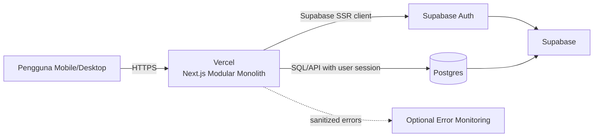

### 6.1 Trust boundaries

1. Browser merupakan untrusted client.
2. Next.js server runtime merupakan trusted application boundary.
3. Supabase Auth menerbitkan dan memvalidasi session.
4. PostgreSQL RLS merupakan data authorization boundary terakhir.
5. Service role key tidak pernah dikirim ke browser.
6. Client-side validation hanya untuk UX, bukan security enforcement.

---

## 7. Container Architecture

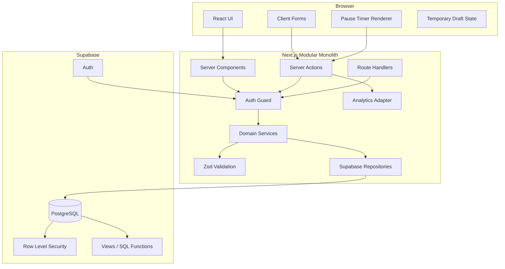

---

## 8. Monolith Modules

| Module | Responsibility | Main data |
|---|---|---|
| `auth` | Login, session, logout, protected navigation | Supabase Auth |
| `profile` | Nickname, payday, risk window | `profiles` |
| `financial-baseline` | Monthly baseline and flexible context | `financial_profiles` |
| `monthly-plan` | Monthly committed, buffer, flexible amount | `monthly_plans` |
| `pause` | Amount, trigger, urge, timer, intent, outcome | `pause_sessions` |
| `reflection` | Post-session reflection | `reflection_entries` |
| `history` | Session listing, filtering, deletion | `pause_sessions` |
| `dashboard` | Aggregated harm-reduction metrics | SQL aggregate |
| `privacy` | Disclaimers and deletion controls | All user-owned tables |
| `analytics` | Privacy-safe product events | Optional aggregate event store |
| `design-system` | Tokens, primitives, accessible components | No database |
| `demo` | Labeled short timer and seeded data | Isolated demo configuration |

### 8.1 Dependency rule

```text
UI
  ↓
Application actions
  ↓
Domain services
  ↓
Repositories
  ↓
Supabase/Postgres
```

Rules:

- UI tidak mengandung query database langsung.
- Domain calculation tidak bergantung pada React.
- Repository tidak menentukan copy.
- RLS tetap aktif walaupun query berasal dari server.
- Modul tidak boleh mengimpor internal file modul lain secara acak.
- Shared code hanya berisi primitive yang benar-benar lintas domain.

---

## 9. Proposed Repository Structure

```text
dompetjujur/
├── app/
│   ├── (public)/
│   │   ├── page.tsx
│   │   ├── login/
│   │   │   └── page.tsx
│   │   └── auth/
│   │       └── callback/
│   │           └── route.ts
│   │
│   ├── (app)/
│   │   ├── layout.tsx
│   │   ├── onboarding/
│   │   │   └── page.tsx
│   │   ├── home/
│   │   │   └── page.tsx
│   │   ├── pause/
│   │   │   ├── new/
│   │   │   │   └── page.tsx
│   │   │   └── [sessionId]/
│   │   │       ├── snapshot/
│   │   │       │   └── page.tsx
│   │   │       ├── timer/
│   │   │       │   └── page.tsx
│   │   │       ├── decision/
│   │   │       │   └── page.tsx
│   │   │       └── outcome/
│   │   │           └── page.tsx
│   │   ├── plan/
│   │   │   └── page.tsx
│   │   ├── history/
│   │   │   └── page.tsx
│   │   ├── dashboard/
│   │   │   └── page.tsx
│   │   ├── profile/
│   │   │   └── page.tsx
│   │   ├── privacy/
│   │   │   └── page.tsx
│   │   └── delete-account/
│   │       └── page.tsx
│   │
│   ├── api/
│   │   ├── dashboard/
│   │   │   └── route.ts
│   │   └── health/
│   │       └── route.ts
│   │
│   ├── error.tsx
│   ├── global-error.tsx
│   ├── loading.tsx
│   └── not-found.tsx
│
├── modules/
│   ├── auth/
│   │   ├── actions.ts
│   │   ├── guard.ts
│   │   └── types.ts
│   ├── profile/
│   │   ├── actions.ts
│   │   ├── repository.ts
│   │   ├── schema.ts
│   │   └── types.ts
│   ├── financial-baseline/
│   │   ├── actions.ts
│   │   ├── calculations.ts
│   │   ├── repository.ts
│   │   ├── schema.ts
│   │   └── types.ts
│   ├── monthly-plan/
│   │   ├── actions.ts
│   │   ├── calculations.ts
│   │   ├── repository.ts
│   │   ├── schema.ts
│   │   └── types.ts
│   ├── pause/
│   │   ├── actions.ts
│   │   ├── calculations.ts
│   │   ├── constants.ts
│   │   ├── repository.ts
│   │   ├── schema.ts
│   │   ├── state-machine.ts
│   │   ├── timer.ts
│   │   └── types.ts
│   ├── reflection/
│   │   ├── actions.ts
│   │   ├── repository.ts
│   │   ├── schema.ts
│   │   └── types.ts
│   ├── history/
│   │   ├── actions.ts
│   │   ├── queries.ts
│   │   └── types.ts
│   ├── dashboard/
│   │   ├── queries.ts
│   │   └── types.ts
│   ├── privacy/
│   │   ├── actions.ts
│   │   └── repository.ts
│   ├── analytics/
│   │   ├── events.ts
│   │   └── track.ts
│   └── demo/
│       ├── config.ts
│       └── seed.ts
│
├── components/
│   ├── ui/
│   ├── app-shell/
│   ├── money-input.tsx
│   ├── choice-card.tsx
│   ├── impact-card.tsx
│   ├── pause-timer.tsx
│   ├── outcome-chip.tsx
│   └── financial-summary.tsx
│
├── lib/
│   ├── supabase/
│   │   ├── client.ts
│   │   ├── server.ts
│   │   ├── middleware.ts
│   │   └── database.types.ts
│   ├── env.ts
│   ├── errors.ts
│   ├── formatters.ts
│   ├── result.ts
│   └── utils.ts
│
├── supabase/
│   ├── config.toml
│   ├── migrations/
│   ├── seed.sql
│   └── tests/
│
├── tests/
│   ├── unit/
│   ├── integration/
│   ├── rls/
│   └── e2e/
│
├── middleware.ts
├── instrumentation.ts
├── package.json
└── README.md
```

### 9.1 Hackathon simplification

Untuk kecepatan, `/pause/new` dapat menggunakan client-side stepper untuk amount dan trigger. Setelah session dibuat, snapshot, timer, decision, dan outcome tetap menggunakan URL dengan `sessionId` agar refresh dapat dipulihkan.

---

## 10. Route and Screen Mapping

| Route | Screen | Authentication |
|---|---|---|
| `/` | Welcome | Public |
| `/login` | Sign in | Public |
| `/onboarding` | S02–S03 | Required |
| `/home` | S04 | Required |
| `/pause/new` | S05–S06 | Required |
| `/pause/[id]/snapshot` | S07 | Required, owner only |
| `/pause/[id]/timer` | S08 | Required, owner only |
| `/pause/[id]/decision` | S09 | Required, owner only |
| `/pause/[id]/outcome` | S10–S12 | Required, owner only |
| `/plan` | S13 | Required |
| `/history` | S14 | Required |
| `/dashboard` | S15 | Required |
| `/profile` | S16 | Required |
| `/privacy` | Privacy notice | Required |
| `/delete-account` | Delete control | Required |

### 10.1 Navigation guard

- Belum login: redirect ke `/login`.
- Sudah login tetapi onboarding belum selesai: redirect ke `/onboarding`.
- Session ID bukan milik user: tampilkan not found, bukan forbidden detail.
- Timer belum eligible: decision route redirect ke timer.
- Session sudah completed: timer atau decision route redirect ke outcome/history.

---

## 11. Authentication Design

### 11.1 Recommended MVP method

Gunakan Supabase Email OTP (6-Digit).

Anonymous auth dapat dipakai sebagai fallback hackathon, tetapi mempunyai konsekuensi:

- pemulihan akun lebih sulit;
- risiko kehilangan data saat browser dibersihkan;
- account deletion perlu dipastikan tetap bekerja;
- upgrade anonymous-to-email harus dirancang bila produk dilanjutkan.

### 11.2 Authentication flow

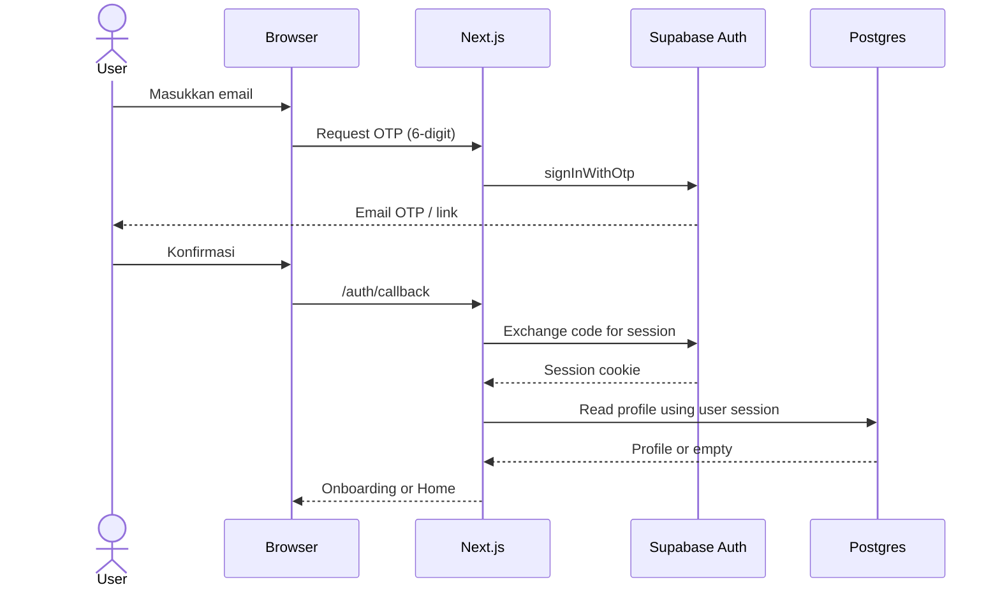

### 11.3 Session rules

- Gunakan `@supabase/ssr`.
- Cookie diperbarui melalui middleware.
- Jangan mempercayai `user_id` dari form.
- Ambil user ID dari authenticated session.
- Setiap write mengulang pemeriksaan auth pada server.
- RLS tetap menjadi enforcement terakhir.

---

## 12. Data Model

### 12.1 Entity relationship diagram

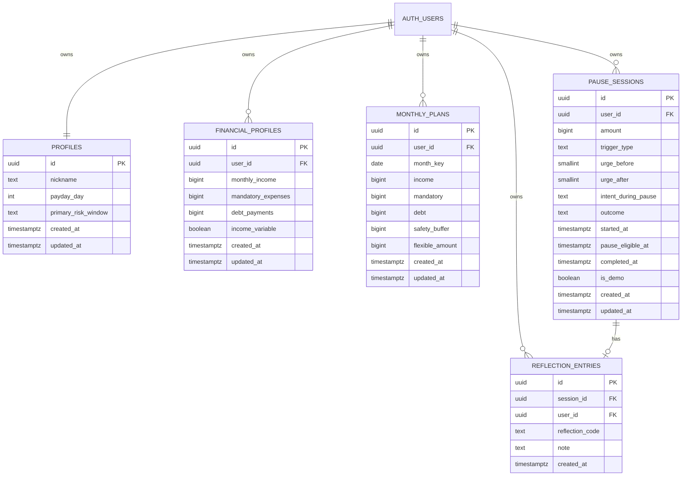

### 12.2 Design clarifications

Beberapa penyesuaian teknis dibutuhkan agar model mendukung alur parsial:

1. `pause_sessions.outcome` harus nullable sampai user mengambil keputusan.
2. `completed_at` nullable sampai session selesai.
3. `urge_after` nullable sampai reflection.
4. `reflection_entries.session_id` harus unique agar satu session maksimal memiliki satu reflection.
5. `monthly_plans` harus unique berdasarkan `(user_id, month_key)`.
6. `pause_sessions.is_demo` ditambahkan agar demo data dapat dikecualikan dari analytics produksi.
7. `updated_at` ditambahkan pada tabel yang dapat diedit.

### 12.3 Data types

- Semua nominal Rupiah disimpan sebagai `bigint`.
- Jangan gunakan floating point untuk uang.
- Nilai UI `Rp350.000` disimpan sebagai `350000`.
- Timestamp menggunakan `timestamptz`.
- Month key disimpan sebagai tanggal hari pertama bulan terkait.

---

## 13. Proposed PostgreSQL Schema

```sql
create extension if not exists pgcrypto;

create type public.risk_window as enum (
  'after_work',
  'late_night',
  'after_payday',
  'after_loss',
  'paylater_available',
  'other'
);

create type public.trigger_type as enum (
  'stress',
  'payday',
  'chasing_loss',
  'boredom_escape',
  'paylater_limit',
  'other'
);

create type public.pause_outcome as enum (
  'delayed',
  'proceeded',
  'redirected'
);

create type public.pause_intent as enum (
  'continue',
  'unsure'
);

create type public.reflection_code as enum (
  'calmer',
  'same',
  'stronger',
  'urge_too_strong',
  'stress',
  'chasing_loss',
  'avoid_thinking',
  'skipped'
);

create table public.profiles (
  id uuid primary key references auth.users(id) on delete cascade,
  nickname text check (char_length(nickname) <= 60),
  payday_day smallint check (payday_day between 1 and 31),
  primary_risk_window public.risk_window,
  created_at timestamptz not null default now(),
  updated_at timestamptz not null default now()
);

create table public.financial_profiles (
  id uuid primary key default gen_random_uuid(),
  user_id uuid not null references auth.users(id) on delete cascade,
  monthly_income bigint not null check (monthly_income >= 0),
  mandatory_expenses bigint not null check (mandatory_expenses >= 0),
  debt_payments bigint not null check (debt_payments >= 0),
  income_variable boolean not null default false,
  created_at timestamptz not null default now(),
  updated_at timestamptz not null default now()
);

create table public.monthly_plans (
  id uuid primary key default gen_random_uuid(),
  user_id uuid not null references auth.users(id) on delete cascade,
  month_key date not null,
  income bigint not null check (income >= 0),
  mandatory bigint not null check (mandatory >= 0),
  debt bigint not null check (debt >= 0),
  safety_buffer bigint not null default 0 check (safety_buffer >= 0),
  flexible_amount bigint not null check (flexible_amount >= 0),
  created_at timestamptz not null default now(),
  updated_at timestamptz not null default now(),
  unique (user_id, month_key),
  check (month_key = date_trunc('month', month_key)::date)
);

create table public.pause_sessions (
  id uuid primary key default gen_random_uuid(),
  user_id uuid not null references auth.users(id) on delete cascade,
  amount bigint not null check (amount > 0),
  trigger_type public.trigger_type not null,
  urge_before smallint check (urge_before between 1 and 5),
  urge_after smallint check (urge_after between 1 and 5),
  intent_during_pause public.pause_intent,
  outcome public.pause_outcome,
  started_at timestamptz not null,
  pause_eligible_at timestamptz not null,
  completed_at timestamptz,
  is_demo boolean not null default false,
  created_at timestamptz not null default now(),
  updated_at timestamptz not null default now(),
  check (pause_eligible_at > started_at),
  check (
    (outcome is null and completed_at is null)
    or
    (outcome is not null and completed_at is not null)
  )
);

create table public.reflection_entries (
  id uuid primary key default gen_random_uuid(),
  session_id uuid not null references public.pause_sessions(id) on delete cascade,
  user_id uuid not null references auth.users(id) on delete cascade,
  reflection_code public.reflection_code not null,
  note text check (char_length(note) <= 240),
  created_at timestamptz not null default now(),
  unique (session_id)
);
```

### 13.1 Indexes

```sql
create index financial_profiles_user_created_idx
  on public.financial_profiles (user_id, created_at desc);

create index monthly_plans_user_month_idx
  on public.monthly_plans (user_id, month_key desc);

create index pause_sessions_user_created_idx
  on public.pause_sessions (user_id, created_at desc);

create index pause_sessions_user_outcome_created_idx
  on public.pause_sessions (user_id, outcome, created_at desc);

create index pause_sessions_user_trigger_idx
  on public.pause_sessions (user_id, trigger_type);

create index reflection_entries_user_created_idx
  on public.reflection_entries (user_id, created_at desc);
```

### 13.2 Updated-at trigger

```sql
create or replace function public.set_updated_at()
returns trigger
language plpgsql
as $$
begin
  new.updated_at = now();
  return new;
end;
$$;

create trigger profiles_set_updated_at
before update on public.profiles
for each row execute function public.set_updated_at();

create trigger financial_profiles_set_updated_at
before update on public.financial_profiles
for each row execute function public.set_updated_at();

create trigger monthly_plans_set_updated_at
before update on public.monthly_plans
for each row execute function public.set_updated_at();

create trigger pause_sessions_set_updated_at
before update on public.pause_sessions
for each row execute function public.set_updated_at();
```

---

## 14. Row Level Security

### 14.1 Policy principle

Setiap pengguna hanya boleh:

- membaca baris miliknya;
- membuat baris dengan `user_id = auth.uid()`;
- mengubah baris miliknya;
- menghapus baris miliknya.

`profiles.id` menggunakan `auth.uid()` secara langsung.

### 14.2 RLS configuration

```sql
alter table public.profiles enable row level security;
alter table public.financial_profiles enable row level security;
alter table public.monthly_plans enable row level security;
alter table public.pause_sessions enable row level security;
alter table public.reflection_entries enable row level security;
```

### 14.3 Profiles policies

```sql
create policy "profiles_select_own"
on public.profiles
for select
using (id = auth.uid());

create policy "profiles_insert_own"
on public.profiles
for insert
with check (id = auth.uid());

create policy "profiles_update_own"
on public.profiles
for update
using (id = auth.uid())
with check (id = auth.uid());

create policy "profiles_delete_own"
on public.profiles
for delete
using (id = auth.uid());
```

### 14.4 Generic user-owned policies

Contoh untuk `pause_sessions`:

```sql
create policy "pause_sessions_select_own"
on public.pause_sessions
for select
using (user_id = auth.uid());

create policy "pause_sessions_insert_own"
on public.pause_sessions
for insert
with check (user_id = auth.uid());

create policy "pause_sessions_update_own"
on public.pause_sessions
for update
using (user_id = auth.uid())
with check (user_id = auth.uid());

create policy "pause_sessions_delete_own"
on public.pause_sessions
for delete
using (user_id = auth.uid());
```

Pola yang sama diterapkan pada:

- `financial_profiles`;
- `monthly_plans`;
- `reflection_entries`.

### 14.5 Reflection ownership integrity

RLS saja tidak memastikan bahwa `reflection_entries.user_id` sama dengan owner session. Tambahkan trigger:

```sql
create or replace function public.validate_reflection_owner()
returns trigger
language plpgsql
security invoker
as $$
declare
  session_owner uuid;
begin
  select user_id
  into session_owner
  from public.pause_sessions
  where id = new.session_id;

  if session_owner is null or session_owner <> new.user_id then
    raise exception 'Reflection owner does not match session owner';
  end if;

  return new;
end;
$$;

create trigger reflection_owner_guard
before insert or update on public.reflection_entries
for each row execute function public.validate_reflection_owner();
```

### 14.6 Mandatory RLS tests

1. User A dapat membaca data A.
2. User A tidak dapat membaca data B.
3. User A tidak dapat update data B.
4. User A tidak dapat delete data B.
5. User A tidak dapat membuat reflection untuk session B.
6. Request tanpa session tidak dapat membaca data personal.
7. Filter atau ID enumeration tidak melewati RLS.

---

## 15. Domain Calculations

### 15.1 Baseline flexible money

```text
raw_flexible = monthly_income - mandatory_expenses - debt_payments
display_flexible = max(raw_flexible, 0)
```

Jika `raw_flexible < 0`:

- jangan tampilkan “aman dibelanjakan”;
- tampilkan pesan netral bahwa ruang uang sedang ketat;
- pengguna tetap dapat memakai Jeda.

### 15.2 Daily context

```text
daily_context = max(raw_flexible / 30, 0)
```

Nilai ini hanya konteks visual, bukan rekomendasi keuangan.

### 15.3 Monthly plan

```text
committed = mandatory + debt + safety_buffer
flexible = max(income - committed, 0)
```

### 15.4 Consequence percentage

```text
percentage =
  flexible_amount > 0
    ? round((pause_amount / flexible_amount) * 100)
    : null
```

Rules:

- Jangan menampilkan persentase jika flexible amount tidak tersedia atau nol.
- Jangan membuat asumsi kategori kebutuhan tanpa data.
- Comparison hanya muncul jika dapat dihitung dari angka pengguna.
- Copy tidak boleh menyebut “uang diselamatkan”.

### 15.5 Money handling

```ts
type Rupiah = number; // integer only at application boundary
```

Implementation rules:

- input hanya digit;
- format dengan locale `id-ID`;
- simpan sebagai integer;
- validasi nominal lebih besar dari nol untuk pause;
- konfirmasi nominal lebih dari `1_000_000_000`;
- jangan gunakan JavaScript decimal untuk operasi kompleks;
- nilai MVP masih aman selama berada dalam safe integer range.

---

## 16. Pause Session State Machine

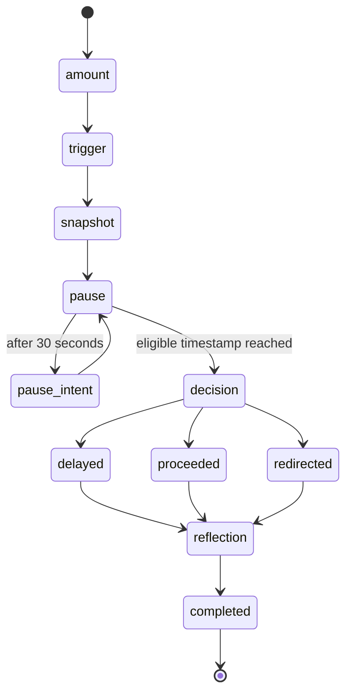

### 16.1 State transition rules

| Current state | Allowed action | Next state |
|---|---|---|
| No session | Submit amount and trigger | Snapshot |
| Snapshot | Start pause | Pause |
| Pause before 30s | Wait only | Pause |
| Pause after 30s | Record intent | Pause |
| Pause before eligible time | Cannot choose outcome | Pause |
| Pause after eligible time | Open decision | Decision |
| Decision | Select delayed | Reflection |
| Decision | Select proceeded | Reflection |
| Decision | Select redirected | Reflection |
| Reflection | Submit or skip | Completed |

### 16.2 Server-side transition enforcement

Client navigation tidak cukup. Server action harus memverifikasi:

- session milik authenticated user;
- `now() >= pause_eligible_at` sebelum menerima outcome;
- session belum memiliki outcome;
- completed session tidak dapat diubah kecuali reflection field yang diizinkan;
- duplicate reflection ditolak oleh unique constraint.

---

## 17. Persistent Timer Design

### 17.1 Core rule

Timer tidak menggunakan local countdown sebagai source of truth.

```text
remaining_seconds =
  max(ceil((pause_eligible_at - current_time) / 1000), 0)
```

### 17.2 Session creation

Server menetapkan:

```text
started_at = server_now
pause_eligible_at = server_now + 90 seconds
```

Production client tidak boleh mengirim `pause_eligible_at`.

### 17.3 Demo mode

Jika:

```text
ALLOW_DEMO_MODE=true
```

dan request membawa mode demo yang jelas, server dapat menetapkan:

```text
pause_eligible_at = server_now + 12 seconds
is_demo = true
```

Rules:

- UI tetap menyebut fitur “Jeda 90 Detik”;
- badge `DEMO` wajib terlihat;
- session demo tidak masuk metrik produksi;
- mode demo tidak aktif secara default di production;
- jangan hanya mempercepat timer di client.

### 17.4 Client rendering algorithm

```ts
function getRemainingSeconds(
  eligibleAtMs: number,
  nowMs: number,
): number {
  return Math.max(Math.ceil((eligibleAtMs - nowMs) / 1000), 0);
}
```

Client dapat memakai interval 250–1000 ms hanya untuk re-render. Nilai selalu dihitung ulang dari timestamp.

### 17.5 Background and refresh behavior

Saat tab kembali aktif:

1. baca `Date.now()`;
2. hitung ulang remaining;
3. render state terbaru;
4. jika nol, tampilkan decision transition;
5. jangan restart timer;
6. jangan menganggap interval yang terlewat sebagai error.

### 17.6 Clock considerations

MVP dapat menggunakan timestamp Supabase sebagai sumber awal. Untuk mengurangi perbedaan clock:

- response create session mengembalikan `started_at` dan `pause_eligible_at`;
- server tetap memvalidasi eligibility saat outcome disimpan;
- client clock hanya mengendalikan display;
- server menjadi authority untuk keputusan.

---

## 18. Core Sequence Diagrams

### 18.1 Onboarding

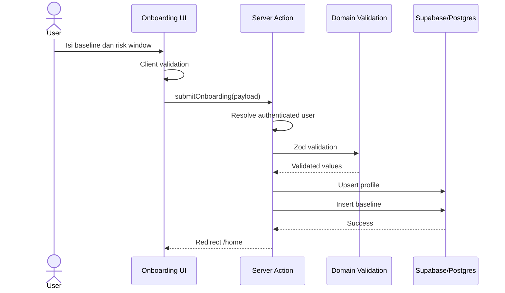

### 18.2 Start pause

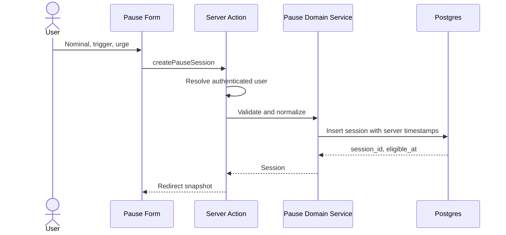

### 18.3 Pause and decision

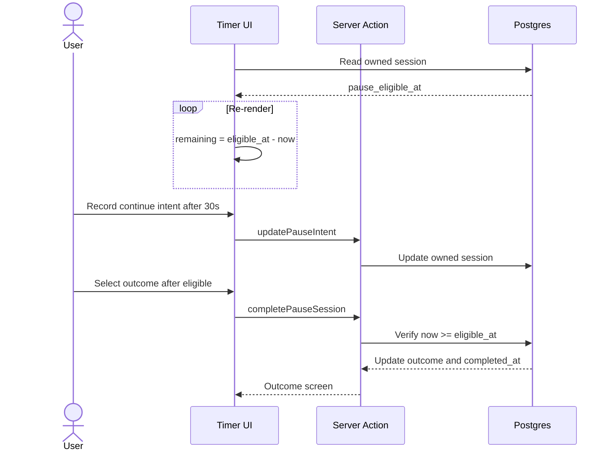

### 18.4 Reflection

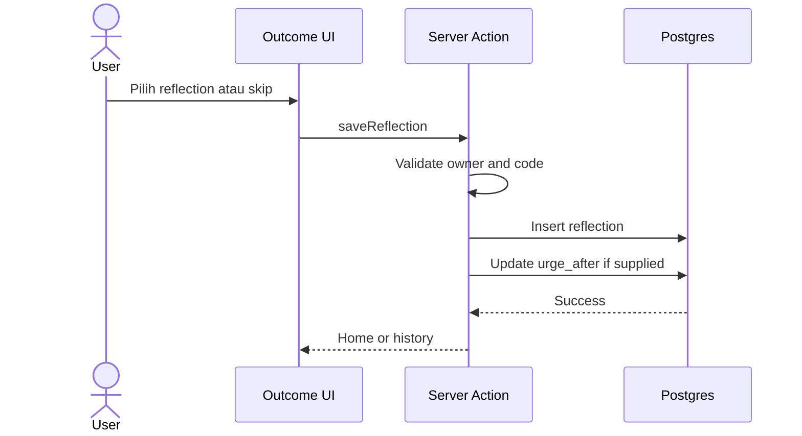

### 18.5 Delete session

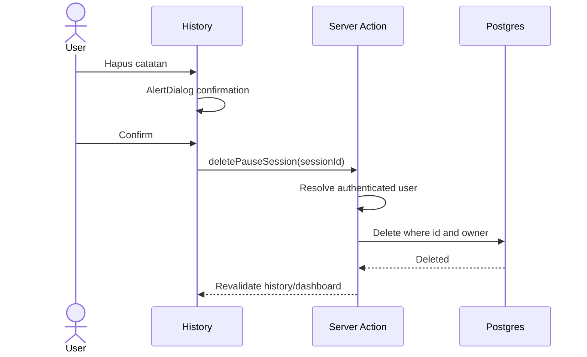

---

## 19. Application Interfaces

### 19.1 Implementation decision

Untuk modular monolith:

- gunakan Server Actions untuk form mutation yang hanya dipakai UI internal;
- gunakan Server Components atau query functions untuk read;
- pertahankan Route Handlers untuk endpoint yang membutuhkan HTTP contract, health check, atau integrasi eksternal;
- semua mutation tetap melewati domain service dan repository.

### 19.2 Server actions

```ts
submitOnboarding(input)
saveMonthlyPlan(input)
createPauseSession(input)
updatePauseIntent(sessionId, intent)
completePauseSession(sessionId, outcome)
saveReflection(sessionId, input)
deletePauseSession(sessionId)
deleteAllHistory()
deleteAccount()
```

### 19.3 HTTP contracts retained from PRD

#### `POST /api/onboarding`

```json
{
  "nickname": "Raka",
  "monthlyIncome": 6000000,
  "mandatoryExpenses": 3600000,
  "debtPayments": 800000,
  "incomeVariable": false,
  "paydayDay": 25,
  "primaryRiskWindow": "late_night"
}
```

#### `POST /api/pause`

```json
{
  "amount": 350000,
  "triggerType": "chasing_loss",
  "urgeBefore": 5,
  "demo": false
}
```

Response:

```json
{
  "id": "uuid",
  "startedAt": "2026-07-25T10:00:00.000Z",
  "pauseEligibleAt": "2026-07-25T10:01:30.000Z",
  "isDemo": false
}
```

#### `PATCH /api/pause/:id`

Intent request:

```json
{
  "intentDuringPause": "continue"
}
```

Outcome request:

```json
{
  "outcome": "delayed",
  "urgeAfter": 3
}
```

#### `GET /api/dashboard`

```json
{
  "totalSessions": 8,
  "delayedSessions": 5,
  "delayedAmount": 1350000,
  "topTrigger": "chasing_loss",
  "lateNightSessions": 4
}
```

#### `DELETE /api/pause/:id`

Response:

```json
{
  "deleted": true
}
```

### 19.4 Standard error response

```json
{
  "error": {
    "code": "PAUSE_NOT_ELIGIBLE",
    "message": "Jeda masih berjalan.",
    "fieldErrors": null,
    "requestId": "opaque-id"
  }
}
```

Do not expose:

- SQL text;
- stack trace;
- Supabase token;
- internal policy names;
- personal financial data in logs.

---

## 20. Validation Rules

### 20.1 Financial input

| Field | Rule |
|---|---|
| Monthly income | Integer, `>= 0` |
| Mandatory expenses | Integer, `>= 0` |
| Debt payments | Integer, `>= 0` |
| Safety buffer | Integer, `>= 0` |
| Payday day | Optional, integer 1–31 |
| Huge amount | Over Rp1.000.000.000 requires confirmation |

### 20.2 Pause input

| Field | Rule |
|---|---|
| Amount | Integer, `> 0` |
| Trigger | Allowed enum only |
| Urge before | Optional integer 1–5 |
| Intent | `continue` or `unsure` |
| Outcome | `delayed`, `proceeded`, or `redirected` |
| Urge after | Optional integer 1–5 |
| Reflection note | Optional, max 240 characters |

### 20.3 Business validation

- Outcome tidak dapat disimpan sebelum `pause_eligible_at`.
- Outcome hanya dapat ditetapkan satu kali.
- Reflection hanya satu per session.
- User tidak dapat memilih session milik user lain.
- Demo session tidak masuk dashboard produksi.
- Negative flexible amount tidak disimpan sebagai negative display value.

---

## 21. Dashboard and Aggregation

### 21.1 Metrics

- total sessions;
- completed sessions;
- delayed sessions;
- proceeded sessions;
- redirected sessions;
- delayed amount total;
- median urge delta;
- top trigger;
- number of sessions after 22:00;
- pause completion rate;
- delay rate.

### 21.2 Query principles

- query selalu terfilter oleh authenticated user melalui RLS;
- exclude `is_demo = true` untuk production metrics;
- history maksimal 30 item;
- gunakan server-side aggregation;
- jangan mengambil semua rows ke browser untuk dihitung.

### 21.3 Suggested SQL view or RPC

Untuk MVP, query langsung dengan aggregate cukup. Bila dashboard berkembang, gunakan SQL function berparameter implisit `auth.uid()`.

Pseudo-query:

```sql
select
  count(*) filter (where completed_at is not null) as total_sessions,
  count(*) filter (where outcome = 'delayed') as delayed_sessions,
  coalesce(sum(amount) filter (where outcome = 'delayed'), 0) as delayed_amount
from public.pause_sessions
where user_id = auth.uid()
  and is_demo = false
  and created_at >= date_trunc('month', now());
```

### 21.4 Top trigger

Hitung dari session user pada periode yang dipilih. Jika jumlah data belum cukup, tampilkan empty state dan jangan membuat inferensi psikologis.

---

## 22. Data Fetching and Caching

### 22.1 Reads

Gunakan Server Components untuk:

- Home summary;
- profile;
- monthly plan;
- history initial data;
- dashboard.

### 22.2 Mutations

Gunakan Server Actions dengan:

- auth check;
- Zod validation;
- domain service;
- repository;
- `revalidatePath()` setelah write.

### 22.3 Caching policy

Data finansial dan session bersifat personal dan dinamis.

Rules:

- jangan gunakan public shared cache;
- gunakan dynamic rendering untuk halaman authenticated;
- jangan menyimpan personal data dalam static output;
- revalidate halaman terkait setelah mutation;
- browser cache tidak boleh menjadi source of truth untuk timer atau outcome.

### 22.4 Optimistic UI

Dapat digunakan untuk:

- filter history;
- local form state;
- loading button;
- remove history row setelah server confirmation.

Jangan gunakan optimistic completion untuk outcome sebelum server memvalidasi timestamp.

---

## 23. UI Architecture

### 23.1 Component layers

```text
Design tokens
  ↓
shadcn/ui primitives
  ↓
DompetJujur reusable components
  ↓
Feature components
  ↓
Route screens
```

### 23.2 Required components

| Component | Responsibility |
|---|---|
| `MoneyInput` | Digits-only Rupiah input |
| `PrimaryButton` | Primary CTA, 52 px height |
| `ChoiceCard` | Accessible radio-like selection |
| `ImpactCard` | Financial consequence |
| `PauseTimer` | Server timestamp-driven display |
| `OutcomeChip` | Delayed, proceeded, redirected |
| `AppHeader` | Context and profile/privacy access |
| `BottomNavigation` | Beranda, Jeda, Riwayat, Saya |
| `FinancialSummary` | Income, assigned, buffer, flexible |
| `ConfirmDeleteDialog` | Destructive confirmation |

### 23.3 Client component boundaries

Client Components hanya untuk:

- interactive form;
- stepper;
- money formatting while typing;
- radio selection;
- timer re-render;
- reduced-motion animation;
- dialog and sheet;
- local filter state.

Data read dan authorization tetap dilakukan pada server.

---

## 24. Design System Implementation

### 24.1 Tokens

```css
:root {
  --ink-900: #16211D;
  --forest-700: #265C4B;
  --forest-600: #32705C;
  --mint-100: #E7F2EC;
  --paper-50: #F8FAF8;

  --white: #FFFFFF;
  --stone-100: #F1F3F1;
  --stone-300: #D6DBD7;
  --stone-500: #7A847E;
  --stone-700: #4D5751;

  --amber-600: #A96617;
  --amber-100: #FFF1D8;
  --red-600: #B54444;
  --red-100: #FCE8E8;
  --blue-600: #3E628F;

  --radius-button: 14px;
  --radius-input: 14px;
  --radius-card: 20px;
  --radius-sheet: 24px;
}
```

### 24.2 Visual constraints

Do not use:

- neon green;
- casino red and black;
- gold gradient;
- flashing animation;
- slot machine imagery;
- coin iconography;
- confetti;
- streak visuals;
- red styling for `proceeded`.

### 24.3 Typography

Use Inter or Geist.

- minimum body: 15 px;
- number cards: 32–40 px;
- tabular numerals;
- clear line height;
- no overly decorative font.

### 24.4 Responsive layout

- 360–430 px: one column, 20 px horizontal padding;
- tablet: intervention max-width 520 px;
- dashboard tablet: max-width 900 px;
- desktop intervention tetap 480–520 px;
- bottom navigation memperhitungkan safe area.

---

## 25. Accessibility

### 25.1 Requirements

- touch targets minimal 44×44 px;
- color bukan satu-satunya pembeda;
- timer menampilkan angka dan label “detik”;
- keyboard navigation bekerja;
- focus ring terlihat;
- form error memiliki pesan teks;
- CTA memenuhi contrast WCAG AA;
- heading order konsisten;
- interactive cards memakai input semantics yang benar;
- destructive action membutuhkan konfirmasi;
- screen reader mendapatkan status perubahan yang penting.

### 25.2 Reduced motion

Jika `prefers-reduced-motion: reduce`:

- breathing scale animation dinonaktifkan;
- timer memakai static circle dan progress ring;
- page transition dipersingkat atau dihapus;
- tidak ada count-up yang mengganggu.

### 25.3 Live region

Gunakan `aria-live="polite"` untuk:

- timer milestone, tidak setiap detik bila terlalu bising;
- save success;
- form error summary;
- reconnect status.

---

## 26. Safety and Content Guardrails

### 26.1 Allowed copy characteristics

- calm;
- direct;
- non-shaming;
- neutral;
- focused on the next decision;
- does not diagnose.

### 26.2 Prohibited behavior

1. Menampilkan betting odds.
2. Membandingkan strategi perjudian.
3. Menggunakan kata “win” untuk outcome.
4. Menggunakan streak.
5. Menghukum relapse secara visual.
6. Memaksa user menghubungi orang lain.
7. Menampilkan nominal privat pada notification preview.
8. Meminta PIN, password bank, atau account number.
9. Menganggap free-text sebagai diagnosis.
10. Mengklaim clinical efficacy.
11. Menyebut uang sebagai “diselamatkan”.
12. Membuat rekomendasi finansial profesional.

### 26.3 Free-text handling

MVP tidak menganalisis note dengan AI. Note:

- opsional;
- maksimal 240 karakter;
- tidak ditampilkan di notification;
- tidak masuk log;
- tidak dipakai untuk diagnosis;
- dapat dipertimbangkan auto-delete setelah 90 hari pada versi berikutnya.

---

## 27. Privacy Design

### 27.1 Data collected

- authenticated user ID;
- nickname opsional;
- payday day opsional;
- risk window;
- financial estimates;
- pause amount;
- trigger;
- urge score;
- outcome;
- reflection code;
- optional note.

### 27.2 Data not collected

- bank credentials;
- PIN;
- account number;
- transaction history;
- gambling account;
- contact list;
- precise location;
- device fingerprint;
- external browsing history;
- betting odds;
- platform-specific gambling activity.

### 27.3 Deletion

#### Delete one session

- delete `pause_sessions` row;
- reflection terhapus melalui cascade;
- dashboard direvalidasi.

#### Delete history

- hapus seluruh `pause_sessions` milik user;
- reflections terhapus melalui cascade;
- financial baseline dan profile tetap ada.

#### Delete account

Recommended sequence:

1. authenticate user again if required;
2. delete auth user through secure server-only admin operation;
3. foreign keys `on delete cascade` menghapus personal rows;
4. revoke session;
5. redirect ke landing;
6. track only aggregate `account_deleted` event without retained user identifier.

Service role hanya boleh dipakai pada isolated server-only function untuk account deletion.

---

## 28. Error Handling

### 28.1 Error categories

| Category | Example | UI behavior |
|---|---|---|
| Validation | Nominal kosong | Inline error |
| Authentication | Session expired | Redirect login with safe message |
| Authorization | Session not owned | Not found |
| Conflict | Outcome already set | Show completed state |
| Timer | Outcome too early | Return timer |
| Network | Connection lost | Preserve local input |
| Database | Write failed | Retry message |
| Unknown | Unexpected exception | Generic error and request ID |

### 28.2 User-facing copy

Use:

> Ada yang belum tersimpan. Coba lagi, inputmu tetap ada di layar.

Avoid exposing technical details.

### 28.3 Draft preservation

For non-sensitive form input:

- keep current React form state;
- optionally use sessionStorage for incomplete onboarding or pause amount;
- clear draft after successful submission;
- do not store tokens or optional reflection note in localStorage.

### 28.4 Offline MVP

MVP behavior:

- show offline status;
- timer display continues from timestamp;
- outcome write waits for reconnect or offers retry;
- true offline mutation queue is deferred to P2;
- do not claim offline sync unless implemented.

---

## 29. Analytics

### 29.1 Event taxonomy

```text
onboarding_started
onboarding_completed
pause_started
pause_snapshot_viewed
pause_30s_reached
pause_90s_completed
pause_outcome_delayed
pause_outcome_proceeded
pause_outcome_redirected
reflection_completed
plan_created
plan_updated
history_viewed
session_deleted
account_deleted
```

### 29.2 Privacy rules

Do not attach:

- exact amount;
- note;
- email;
- nickname;
- gambling platform;
- account identifier;
- full timestamp if coarse aggregation is sufficient.

Safe properties may include:

- demo flag;
- coarse viewport class;
- outcome category;
- trigger category;
- completion stage;
- anonymous installation/session identifier only when consent and privacy policy support it.

### 29.3 Impact metrics

```text
pause_completion_rate =
  pause_90s_completed / pause_started

delay_rate =
  delayed_sessions / completed_sessions

delayed_amount_total =
  sum(amount where outcome = delayed)

urge_delta =
  average(urge_before - urge_after)

return_to_pause_within_7d =
  users returning to a new pause within 7 days
```

Do not present these as clinical outcomes.

---

## 30. Observability

### 30.1 Application monitoring

Track:

- server action error rate;
- auth callback failures;
- database query failures;
- timer completion write failures;
- route latency;
- Core Web Vitals;
- production build status.

### 30.2 Logging rules

Log:

- request ID;
- operation name;
- success/failure;
- error code;
- duration;
- environment.

Do not log:

- exact financial amount;
- reflection note;
- auth token;
- service role key;
- email address;
- raw Supabase response containing personal data.

### 30.3 Health endpoint

`GET /api/health`

Response:

```json
{
  "status": "ok",
  "service": "dompetjujur-web"
}
```

Health endpoint tidak perlu membaca data personal.

---

## 31. Security Design

### 31.1 Main threats

| Threat | Control |
|---|---|
| IDOR | RLS and owner checks |
| Exposed service key | Server-only env and import boundary |
| Client timestamp manipulation | Server validates eligibility |
| Cross-user reflection | Trigger plus RLS |
| XSS through notes | React escaping, validation, no raw HTML |
| CSRF-like mutation abuse | Same-site cookies and server action auth |
| SQL injection | Supabase parameterized API |
| Sensitive logging | Logging allowlist |
| Account enumeration | Generic auth messages |
| Brute-force auth | Supabase Auth limits |
| Demo data contamination | `is_demo` exclusion |

### 31.2 Security headers

Recommended:

```text
Content-Security-Policy
Referrer-Policy: strict-origin-when-cross-origin
X-Content-Type-Options: nosniff
Permissions-Policy
Strict-Transport-Security
```

CSP harus disesuaikan dengan Supabase dan monitoring yang benar-benar digunakan.

### 31.3 Environment separation

Gunakan proyek Supabase berbeda untuk:

- local;
- preview/staging;
- production.

Jangan memakai database production untuk automated E2E.

---

## 32. Environment Variables

```bash
NEXT_PUBLIC_SUPABASE_URL=
NEXT_PUBLIC_SUPABASE_ANON_KEY=

# Server only
SUPABASE_SERVICE_ROLE_KEY=

# App
NEXT_PUBLIC_APP_URL=
ALLOW_DEMO_MODE=false
APP_ENV=development

# Optional
SENTRY_DSN=
NEXT_PUBLIC_SENTRY_DSN=
```

Rules:

- `SUPABASE_SERVICE_ROLE_KEY` hanya server;
- validasi environment saat startup;
- jangan commit `.env.local`;
- preview dan production memakai secret berbeda;
- anon key boleh di client tetapi tetap bergantung pada RLS.

---

## 33. Testing Strategy

### 33.1 Test pyramid

```text
E2E tests
Integration and RLS tests
Component tests
Unit tests
Static checks
```

### 33.2 Static checks

- TypeScript strict;
- ESLint;
- production build;
- SQL migration validation;
- generated Supabase types up to date.

### 33.3 Unit tests

Test:

- Rupiah parser and formatter;
- flexible money calculation;
- monthly plan calculation;
- consequence percentage;
- timer remaining calculation;
- state transition rules;
- Zod schemas;
- analytics property sanitizer.

### 33.4 Component tests

Test:

- `MoneyInput`;
- `ChoiceCard`;
- urge scale;
- `PauseTimer`;
- reduced-motion state;
- `OutcomeChip`;
- delete confirmation;
- empty and error states.

### 33.5 Integration tests

Test against Supabase local:

- onboarding writes correct rows;
- monthly plan upsert;
- session creation uses server time;
- outcome rejected before eligibility;
- outcome accepted after eligibility;
- reflection unique constraint;
- delete session cascades reflection;
- dashboard excludes demo sessions.

### 33.6 RLS tests

Use two test users:

```text
User A
User B
```

Verify every table and operation.

### 33.7 E2E critical path

```text
Sign in
→ onboarding
→ financial baseline
→ Home
→ start pause
→ amount
→ trigger
→ snapshot
→ timer
→ refresh
→ timer remains correct
→ decision
→ delayed outcome
→ reflection
→ history
→ delete session
```

Additional E2E:

- proceeded flow uses neutral copy;
- redirected flow works;
- negative flexible context is neutral;
- mobile 360 px layout;
- reduced motion;
- account deletion;
- expired session;
- network failure and retry;
- demo badge and shortened timer.

### 33.8 Accessibility tests

- axe scan;
- keyboard-only flow;
- screen reader semantics;
- focus order;
- contrast;
- touch target review;
- no flashing;
- timer textual status.

---

## 34. CI/CD

### 34.1 Pull request pipeline

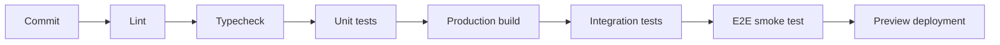

### 34.2 Production deployment

1. merge to main;
2. run static checks;
3. validate pending migrations;
4. apply Supabase migration;
5. deploy Next.js to Vercel;
6. run smoke test;
7. verify auth callback;
8. verify RLS;
9. verify pause timer;
10. monitor errors.

### 34.3 Migration policy

- SQL migration is source of truth;
- never edit production schema manually without migration;
- migration names use timestamp and clear description;
- destructive migration requires explicit review;
- generated TypeScript database types updated after schema change;
- seed data must never contain real personal data.

---

## 35. Deployment Topology

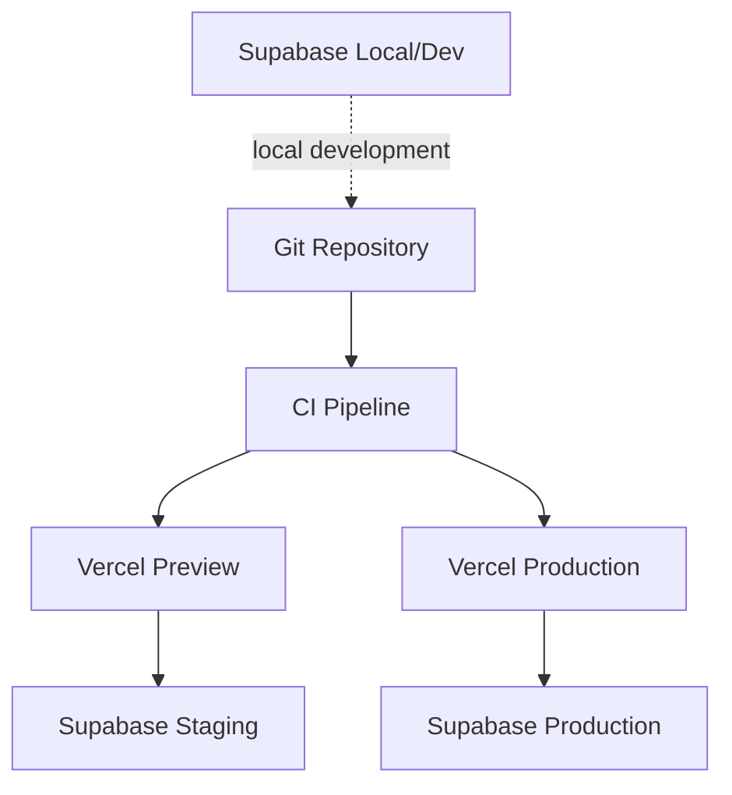

### 35.1 Runtime scaling

- Next.js server tier stateless;
- Vercel scales web requests horizontally;
- Supabase manages Postgres;
- no in-memory session state required;
- timer state lives in database timestamps;
- no sticky session needed.

---

## 36. Performance Budget

### 36.1 UX targets

- core interaction responsive on 360–430 px mobile;
- main CTA above fold;
- no large animation library required;
- financial calculations run locally and server-side quickly;
- initial Home payload contains only required data;
- history limited to 30 rows.

### 36.2 Performance controls

- use Server Components by default;
- lazy-load noncritical dashboard visualizations;
- use Lucide icons selectively;
- avoid large chart library for MVP;
- optimize font loading;
- avoid unnecessary global state;
- avoid repeated Supabase queries per render;
- use database indexes described above.

---

## 37. Library and Tool Map

### 37.1 Runtime

| Need | Library |
|---|---|
| Framework | Next.js |
| Language | TypeScript |
| Database/Auth | `@supabase/supabase-js`, `@supabase/ssr` |
| Styling | Tailwind CSS |
| UI primitives | shadcn/ui, Radix primitives |
| Icons | `lucide-react` |
| Forms | `react-hook-form` |
| Validation | `zod`, `@hookform/resolvers` |
| Toast | `sonner` |
| Date/time | Native `Date` or `date-fns` |
| Class utilities | `clsx`, `tailwind-merge`, `class-variance-authority` |

### 37.2 Development and testing

| Need | Tool |
|---|---|
| Package manager | pnpm |
| Database local environment | Supabase CLI + Docker |
| Unit tests | Vitest |
| Component tests | React Testing Library |
| E2E | Playwright |
| Accessibility | `@axe-core/playwright` |
| Formatting | Prettier |
| Static checks | ESLint, TypeScript |
| Error monitoring | Sentry, optional |
| Deployment | Vercel CLI |

### 37.3 Not required for MVP

- Prisma;
- Drizzle;
- Redis;
- XState, unless state flow becomes difficult to maintain;
- Zustand or Redux for server data;
- Realtime;
- Edge Functions;
- background queue;
- charting library;
- LLM SDK.

---

## 38. Implementation Phases

### Phase 0: Foundation

- initialize Next.js and TypeScript;
- Tailwind and shadcn/ui;
- Supabase local project;
- environment validation;
- auth SSR;
- schema and RLS;
- generated database types;
- app shell and tokens.

### Phase 1: P0 Core

- onboarding;
- financial baseline;
- Home;
- monthly plan;
- pause amount and trigger;
- consequence snapshot;
- persistent timer;
- decision;
- outcome;
- reflection;
- history;
- session deletion;
- profile and privacy;
- account deletion.

### Phase 2: Quality

- dashboard aggregates;
- empty/loading/error states;
- accessibility;
- reduced motion;
- RLS tests;
- E2E;
- demo mode;
- monitoring;
- deployment.

### Phase 3: P1

- quick trigger optimization;
- dashboard detail;
- relapse recovery refinement;
- time pattern insight.

### Phase 4: P2 after validation

- reminders;
- trusted contact;
- PWA install;
- export;
- AI reflection summary with separate safety review.

---

## 39. Cut-line for Hackathon

If delivery is behind schedule, preserve:

```text
Authentication
→ Onboarding
→ Financial baseline
→ Jeda 90 Detik
→ Outcome
→ Reflection
→ History
→ RLS
→ Privacy and delete
```

Simplify or remove:

- dashboard detail;
- time insights;
- trusted contact;
- reminders;
- AI;
- PWA install;
- true offline sync;
- advanced animation.

Never cut:

- RLS;
- server-derived timer;
- neutral safety copy;
- account deletion;
- validation;
- visible demo labeling.

---

## 40. Architecture Decision Records

### ADR-001: Modular monolith

**Decision:** Satu Next.js application dan satu Supabase project.  
**Reason:** Kecepatan, simplicity, dan deployment yang mudah.  
**Consequence:** Module boundaries harus dijaga di codebase.

### ADR-002: Supabase Auth and RLS

**Decision:** Authorization dilakukan dua lapis, server auth check dan PostgreSQL RLS.  
**Reason:** Browser tidak dipercaya dan IDOR harus dicegah.  
**Consequence:** Semua table personal wajib memiliki policy dan test.

### ADR-003: Server-derived pause eligibility

**Decision:** `pause_eligible_at` ditentukan server.  
**Reason:** Refresh dan background tidak boleh mereset timer.  
**Consequence:** Client timer hanya renderer.

### ADR-004: Deterministic MVP

**Decision:** Tidak memakai LLM dalam core flow.  
**Reason:** Core product membutuhkan reliability, safety, dan latency rendah.  
**Consequence:** Copy dan recommendation memakai rule set tetap.

### ADR-005: Integer Rupiah

**Decision:** Nominal disimpan sebagai bigint integer.  
**Reason:** Menghindari floating point error.  
**Consequence:** Formatting dilakukan pada presentation layer.

### ADR-006: Server Actions for internal mutations

**Decision:** Form internal memakai Server Actions. HTTP Route Handlers hanya untuk contract yang diperlukan.  
**Reason:** Mengurangi boilerplate dalam monolith.  
**Consequence:** Domain service tetap reusable agar tidak terikat langsung ke React.

### ADR-007: No external state store for MVP

**Decision:** Gunakan Server Components, form state, dan URL/session ID.  
**Reason:** State utama berada di database.  
**Consequence:** Tambahkan state library hanya jika kompleksitas benar-benar meningkat.

### ADR-008: Demo mode is isolated

**Decision:** Demo mode diberi label dan session ditandai `is_demo`.  
**Reason:** Demo tidak boleh memalsukan production analytics.  
**Consequence:** Dashboard production mengecualikan demo rows.

---

## 41. Open Questions

Poin berikut belum dipastikan secara penuh oleh source documents dan perlu diputuskan sebelum production release:

1. Apakah login utama memakai Email OTP (6 digit) atau anonymous auth?
2. Apakah `financial_profiles` menyimpan histori baseline atau hanya satu baseline aktif?
3. Apakah user dapat mengedit session setelah outcome dipilih?
4. Apakah reflection note akan dihapus otomatis setelah 90 hari?
5. Apakah dashboard memakai zona waktu Asia/Jakarta secara eksplisit untuk insight setelah pukul 22.00?
6. Apakah demo mode hanya aktif pada preview deployment atau juga production dengan flag?
7. Apakah account deletion memerlukan re-authentication?
8. Apakah analytics disimpan internal di Supabase atau menggunakan provider eksternal?
9. Apakah PWA menjadi bagian demo atau sepenuhnya dipindahkan ke P2?
10. Apakah comparison kebutuhan memerlukan input kategori anggaran tambahan? Source documents belum mendefinisikan tabel kategori kebutuhan.

### Recommended MVP answers

- gunakan Email OTP;
- satu baseline aktif untuk UI, histori baseline dapat ditunda;
- outcome immutable;
- note tidak auto-delete pada hackathon, tetapi kebijakan retention ditampilkan sebagai future work;
- gunakan Asia/Jakarta untuk insight lokal;
- demo hanya preview atau environment yang diizinkan;
- account deletion meminta konfirmasi kuat, re-auth jika session lama;
- analytics internal minimal atau tidak dipasang;
- PWA ditunda;
- consequence comparison hanya memakai angka yang benar-benar tersedia.

---

## 42. Definition of Done

### Product

- [ ] User dapat login.
- [ ] User dapat menyelesaikan onboarding.
- [ ] Baseline finansial tersimpan.
- [ ] Home menampilkan quick trigger.
- [ ] Jeda dapat dimulai dalam maksimal dua tap.
- [ ] Timer bertahan setelah refresh.
- [ ] Server menolak outcome sebelum eligible.
- [ ] Outcome dapat dipilih secara netral.
- [ ] Reflection dapat disimpan atau dilewati.
- [ ] History menampilkan maksimal 30 sesi.
- [ ] User dapat menghapus satu sesi.
- [ ] Dashboard aggregate benar.
- [ ] User dapat menghapus akun dan data.
- [ ] Disclaimer dan privacy notice mudah ditemukan.

### Engineering

- [ ] Supabase Auth SSR bekerja.
- [ ] Semua tabel personal memakai RLS.
- [ ] RLS dites dengan dua user.
- [ ] Tidak ada service role key dalam client bundle.
- [ ] Production build berhasil.
- [ ] TypeScript strict tanpa error.
- [ ] Unit test domain calculation lulus.
- [ ] E2E core flow lulus.
- [ ] Mobile 360, 390, dan 430 px diuji.
- [ ] Reduced motion didukung.
- [ ] Error, loading, dan empty state tersedia.
- [ ] Demo session tidak masuk analytics produksi.

### Safety

- [ ] Tidak ada betting odds.
- [ ] Tidak ada strategi taruhan.
- [ ] Tidak ada streak.
- [ ] Tidak ada confetti.
- [ ] `proceeded` tidak memakai warna merah.
- [ ] Tidak ada shame copy.
- [ ] Tidak ada clinical claim.
- [ ] Tidak ada bank credential request.
- [ ] Notification, jika nanti dibuat, tidak menampilkan nominal privat.

---

## 43. Traceability Matrix

| Source requirement | System component |
|---|---|
| Onboarding + baseline | `profile`, `financial-baseline` |
| Jeda 90 Detik | `pause` module and persistent timer |
| Rencana Aman Gajian | `monthly-plan` |
| Outcome + reflection | `pause`, `reflection` |
| Quick Trigger CTA | Home UI and `/pause/new` |
| History | `history` module |
| Dashboard | `dashboard` aggregate queries |
| Relapse recovery | Outcome copy and proceeded flow |
| Trusted Contact P2 | Deferred module |
| Risk-window reminder P2 | Deferred scheduler/notification |
| AI reflection P2 | Deferred and separate safety design |
| Privacy-first | Data minimization, RLS, delete controls |
| Mobile-first | Responsive design rules |
| Non-judgmental | Safety copy policy |
| Timer survives refresh | Server timestamp design |
| No red proceeded state | Outcome component token rules |
| Demo mode | `demo` configuration and `is_demo` |
| No bank sync | Explicit non-goal and data boundary |
| No streak | Dashboard metric restrictions |

---

## 44. Final Architecture Summary

DompetJujur dibangun sebagai satu Next.js modular monolith yang terhubung ke satu Supabase project.

Next.js menangani:

- rendering;
- route protection;
- forms;
- Server Actions;
- domain orchestration;
- UI;
- error handling.

Supabase menangani:

- authentication;
- PostgreSQL storage;
- RLS;
- constraints;
- indexes;
- aggregate query.

Core architectural rule:

> Browser mengendalikan pengalaman, tetapi server dan database mengendalikan kebenaran.

Core timer rule:

> Countdown boleh dirender di client, tetapi eligibility harus ditentukan dan diverifikasi oleh server.

Core privacy rule:

> Simpan data minimum, batasi setiap row kepada pemiliknya, dan jangan mencatat data finansial sensitif pada analytics atau logs.

Core safety rule:

> Sistem memberi jarak sebelum keputusan, bukan menghakimi keputusan pengguna.
